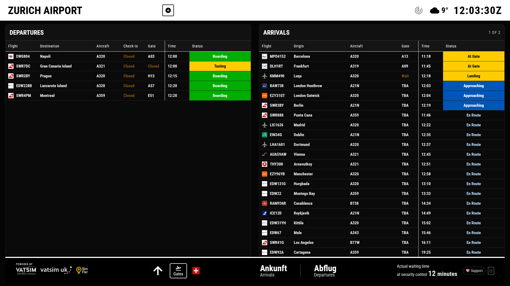
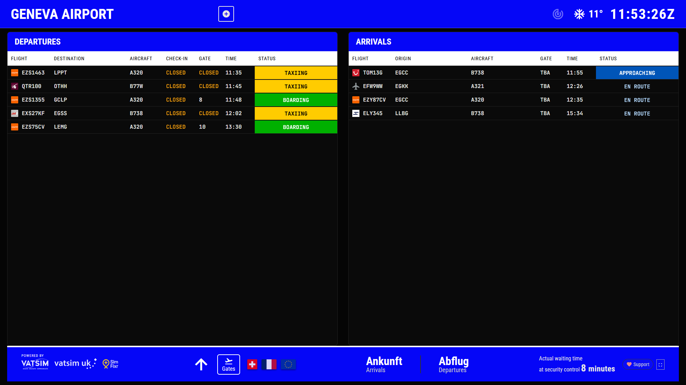
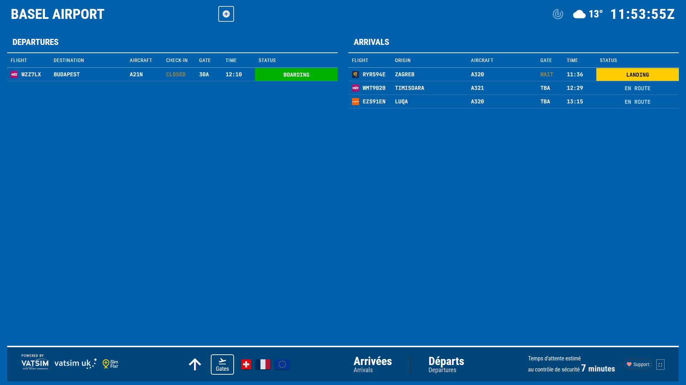
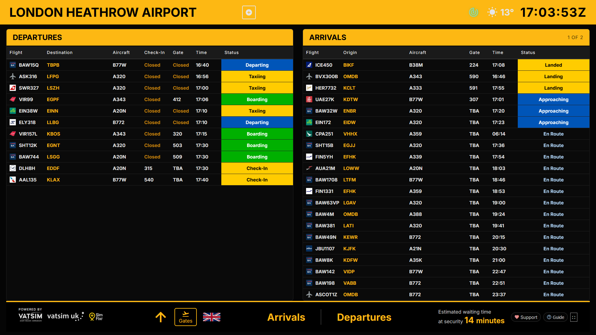
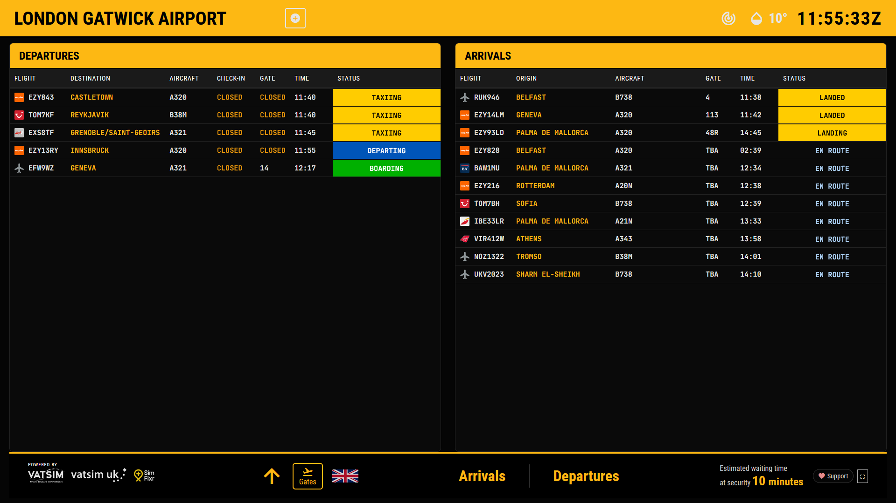
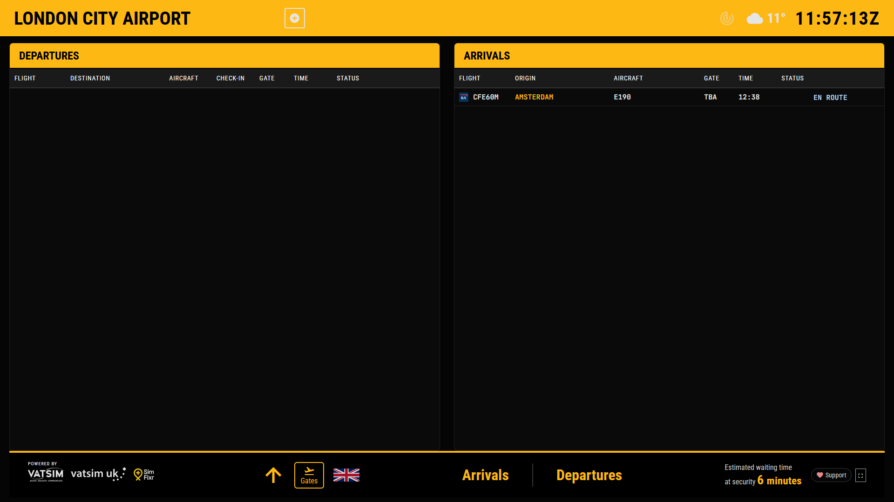
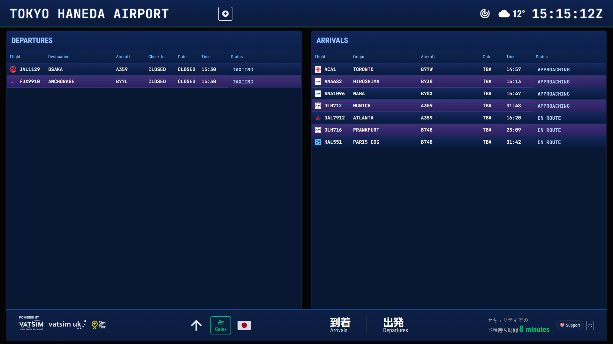

# VATSIM Flight Information Display System 
A professional, real-time Flight Information Display System (FIDS) designed for VATSIM operations. This application replicates the visual style and functionality of modern airport information screens found at major international airports.

It is optimised for use on dedicated display monitors in both portrait and landscape orientations.

## Features

### Core Functionality
* **Universal Airport Support:** Instantly load *any* airport on the VATSIM network by searching for its ICAO code in the UI.
* **Direct Link Loading:** Open the board directly to an airport using `?icao=XXXX` (or `?airport=XXXX`) in the URL.
* **Pre-Configured Hubs:** One-click switching between major hubs: LSZH, LSGG, LFSB, EGLL, EGKK, and KJFK.
* **Real-Time Data:** Automatically fetches and refreshes pilot and flight plan data from the VATSIM Public Data API (v3) every 60 seconds.
* **Live WebSockets:** Uses Socket.IO to push updates immediately to the client without requiring a page refresh.
* **Header Widgets:** Live ATC status with controller popover, plus METAR-driven weather icon and temperature display.
* **Responsive Layout:**
    * **Landscape Mode:** Displays Departures and Arrivals side-by-side.
    * **Portrait Mode:** Automatically stacks tables vertically for optimal use on vertical monitors.
* **Auto-Scroll Engine:** Smart scrolling logic detects overflow. If the list of flights exceeds the screen height, it automatically scrolls to show hidden flights, then loops back to the top.

### Intelligent Logic
* **UKCP Stand Integration:** Direct integration with the VATSIM UK Controller Panel API to display real-time stand assignments for UK airports (EGLL, EGKK, etc.).
* **Status Detection:** Automatically determines flight phases (Boarding, Taxiing, Departing, Landing) based on transponder codes, ground speed, and altitude.
* **Smart Delay Calculation:** Compares scheduled departure times against current UTC time to generate accurate delay warnings.
* **Geospatial Filtering:**
    * **Departures:** Visible while at the gate and until they leave the immediate terminal airspace (>80 km).
    * **Arrivals:** Appear when within realistic radar range (<250 km) and persist until parked.
* **Smart Check-In Allocation:** Deterministically assigns check-in desks based on airline and terminal, with airport-specific logic for supported hubs.

### Visual Design & Dynamic Theming
* **Modular Theme System:** Each airport has its own CSS theme file for easy customization.
* **Dynamic Theme Loading:** Themes are loaded on-demand. Non-configured airports automatically use a high-contrast "Default" theme.
* **Airport-Specific Branding:** The interface adapts to match real-world airport branding:
    * **LSZH (Zurich):** High-contrast White/Black header with Yellow accents.
    * **LSGG (Geneva):** Geneva Blue headers with White text.
    * **LFSB (Basel):** Immersive "EuroAirport Blue" background.
    * **EGLL (Heathrow):** Classic Heathrow Yellow header with Black text.
    * **EGKK (Gatwick):** Distinctive Gatwick Yellow and Black styling.
    * **KJFK (New York):** Retro "Solari" split-flap style with the custom B612 font.
* **Hybrid Display Style:**
    * **Flight Data:** Rendered as clean, high-visibility text.
    * **Status Column:** Rendered as solid, edge-to-edge colored blocks for instant readability.
* **Advanced Logo Handling:** * **Dynamic Resolution:** Automatically fetches and maps airline codes (ICAO to IATA) to pull high-quality logos from the web.
    * **Fallback System:** Prioritizes local files for special ops (FedEx, Rega), then falls back to Kiwi.com and Kayak APIs for commercial carriers.

## Screenshots

### Zurich (LSZH) - Classic Style


### Geneva (LSGG) - Blue Header Theme


### Basel (LFSB) - EuroAirport Blue Theme


### London Heathrow (EGLL) - Yellow Theme


### London Gatwick (EGLL) - Yellow Theme


### London City (EGLC) - Yellow Theme


### Tokyo Haneda (RJTT) - Haneda Theme


## Technical Stack

* **Backend:** Python 3.8+, Flask, Flask-SocketIO
* **Scheduler:** APScheduler (Background data fetching)
* **Frontend:** HTML5, CSS3 (Flexbox/Grid), JavaScript (ES6+)
* **Data Sources:** * VATSIM Data API v3
    * UKCP API (Stand assignments)
    * GitHub Airline Codes Database (Logo mapping)
* **Theme System:** Modular CSS architecture with dynamic loading

## Installation

### Prerequisites
* Python 3.8 or higher
* pip (Python package installer)

### Setup

1.  **Clone the repository:**
    ```bash
    git clone [https://github.com/yourusername/vatsim-flight-board.git](https://github.com/yourusername/vatsim-flight-board.git)
    cd vatsim-flight-board
    ```

2.  **Install dependencies:**
    ```bash
    pip install -r requirements.txt
    ```
    *If requirements.txt is missing:*
    ```bash
    pip install flask flask-socketio requests apscheduler eventlet python-dotenv
    ```

3.  **Run the application:**
    ```bash
    python app.py
    ```

4.  **Access the board:**
    Open a web browser and navigate to `http://localhost:5000`

## Configuration

### Adding Logos Manually
To ensure cargo or special operators (e.g., FedEx, Rega) have logos:
1.  Save the logo as a PNG file (e.g., `FX.png` for FedEx).
2.  Place the file in `static/logos/`.
3.  The system will automatically prioritize this local file over web sources.

### Customizing Airports
You can add specific logic for new airports in `checkin_assignments.py` (for desk rules) and `static/stands.json` (for geofenced gate logic). However, the system now supports **Universal Search**, so any valid ICAO code will work out-of-the-box with the Default theme.

## Current Configured Airports

| ICAO | Name | Terminals | Stands | Theme |
|------|------|-----------|--------|-------|
| LSZH | Zurich Airport | Multiple piers | 152 | White/Black/Yellow |
| LSGG | Geneva Airport | Main + French | 31 | Geneva Blue |
| LFSB | EuroAirport Basel | French/Swiss | 79 | EuroAirport Blue |
| EGLL | London Heathrow | T2, T3, T4, T5 | 248 | Heathrow Yellow |
| EGKK | London Gatwick | North/South | UKCP | Gatwick Yellow |
| KJFK | New York JFK | T1, T4, T5, T7, T8 | 35 | Solari Split-Flap |

*Note: Any other airport can be loaded via the "+" button in the UI.*

## License

This project is open-source and available under the MIT License.

## Acknowledgements

* **Data:** VATSIM Network & UK Controller Panel (UKCP)
* **Logos:** Kiwi.com, Kayak, and airline-codes database
* **Fonts:** Roboto Condensed, JetBrains Mono, and B612 via Google Fonts
* **Stand Data:** Extracted from airport charts and Google Earth

## Roadmap

- [x] Add more European airports (EGKK added)
- [x] Add North American airports (KJFK added)
- [x] Implement custom themes for major hub airports
- [x] Universal Airport Search (Dynamic loading)
- [ ] Asian Pacific airports (VHHH, WSSS, YSSY)
- [x] Add METAR/weather display widget
- [x] Add ATC/controller widget with live popover
- [ ] Aircraft type silhouettes/icons

## Bonus - Running as a Dedicated Kiosk Display

Want to run the flight board on a dedicated monitor? Here's how to set up a Raspberry Pi (or any Linux machine) as a fullscreen kiosk display.

### Hardware Requirements
- Raspberry Pi 4B (or any Linux PC)
- Monitor (works great in portrait mode!)
- Optional: Bluetooth mouse for interaction
- Network connection to your Flask server

### Quick Setup Guide

**1. Install Ubuntu Server 24.04 LTS**

Flash to SD card and boot up.

**2. Install GUI Components & Fonts**
```bash
sudo apt update && sudo apt upgrade -y
sudo apt install -y xorg openbox lightdm unclutter
sudo snap install chromium

# Install international fonts for proper character rendering
sudo apt install -y fonts-noto-cjk fonts-noto-cjk-extra fonts-noto-color-emoji
```

**3. Configure Auto-Login**

```bash
sudo nano /etc/lightdm/lightdm.conf
```

Add under `[Seat:*]`:
```ini
autologin-user=YOUR_USERNAME
autologin-user-timeout=0
user-session=openbox
```

**4. Create Kiosk Autostart Script**

```bash
mkdir -p ~/.config/openbox
nano ~/.config/openbox/autostart
```

Paste this (replace `YOUR_SERVER_IP` with your Flask server's IP):

```bash
#!/bin/bash

# Disable screen blanking
xset s off
xset -dpms
xset s noblank

# Hide mouse cursor
unclutter -idle 0.1 &

# Optional: Rotate to portrait mode
# xrandr --output HDMI-1 --rotate right &
# sleep 2

# Wait for network
sleep 5

# Launch fullscreen kiosk
/snap/bin/chromium \
  --kiosk \
  --noerrdialogs \
  --disable-infobars \
  --no-first-run \
  --app=http://YOUR_SERVER_IP:5000
```

```bash
chmod +x ~/.config/openbox/autostart
```

**5. Reboot**

```bash
sudo reboot
```

Your Pi will now boot directly into the flight board in fullscreen!

### Optional: Portrait Mode

To rotate the display 90° for portrait orientation, add this line to your autostart script **before** the Chromium launch:

```bash
xrandr --output HDMI-1 --rotate right &
sleep 2
```

The CSS automatically adapts to stack Departures/Arrivals vertically in portrait mode.

### Optional: Bluetooth Mouse

```bash
sudo apt install -y bluez bluez-tools
sudo systemctl enable bluetooth
bluetoothctl
```

In bluetoothctl:
```
power on
agent on
scan on
# Wait for your mouse to appear, then:
pair XX:XX:XX:XX:XX:XX
trust XX:XX:XX:XX:XX:XX
connect XX:XX:XX:XX:XX:XX
exit
```

### Updating the Display

**Frontend changes** (JavaScript/CSS/HTML) update automatically - just hard refresh:
```bash
ssh user@pi-ip
DISPLAY=:0 xdotool search --class chromium key ctrl+shift+r
```

**Backend changes** (Python) require restarting Flask on your server (not the Pi).

### Troubleshooting

**Black screen?**
- Check `/var/log/lightdm/lightdm.log`
- Verify username in lightdm.conf matches your actual user

**Can't reach server?**
```bash
ping YOUR_SERVER_IP
curl http://YOUR_SERVER_IP:5000
```

**Wrong display orientation?**
```bash
# Check current rotation
DISPLAY=:0 xrandr

# Change rotation (normal/left/right/inverted)
DISPLAY=:0 xrandr --output HDMI-1 --rotate right
```

### Architecture

The Pi acts as a "dumb terminal" - all processing happens on your Flask server:

```
┌─────────────────────┐
│   Flask Server      │  ← Fetches VATSIM data
│   (Proxmox/PC)      │  ← Processes flight logic
│   Port 5000         │  ← Serves web interface
└──────────┬──────────┘
           │ HTTP + WebSocket
           ↓
┌─────────────────────┐
│   Raspberry Pi      │  ← Just displays browser
│   (Kiosk Mode)      │  ← No processing
└─────────────────────┘
```

This keeps the Pi lightweight and all your logic centralized on a proper server.

---
